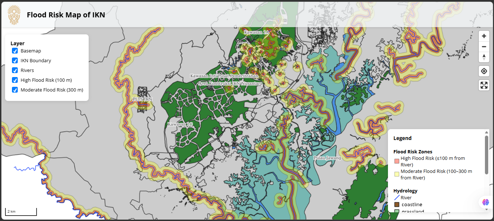

# Flood Risk Map of IKN

A web-based Geographic Information System (WebGIS) application for visualizing flood risk zones in Ibu Kota Nusantara (IKN), Indonesia. This application uses MapLibre GL JS for interactive mapping and integrates with GeoServer for Web Map Service (WMS) layers.

## Author

**Nur Inna Alfianinda**  
Perekayasa di Direktorat Data dan Kecerdasan Buatan  
Otorita Ibu Kota Nusantara

## Overview

This project displays flood risk areas in IKN based on proximity to rivers:
- **High Flood Risk**: Areas within 100 meters of rivers
- **Moderate Flood Risk**: Areas between 100-300 meters from rivers

The map includes additional layers for administrative boundaries, hydrology, and basemap imagery.

## Screenshot



## Project Structure

```
oikn-webgis-training-mapid2/
├── frontend/              # Frontend application (MapLibre + Vite)
│   ├── index.html
│   ├── package.json
│   ├── vite.config.js
│   └── src/
│       └── main.js
├── data/                  # GeoServer data files (Shapefiles and styles)
│   ├── buffer_banjir_100m_IKN.*  # Shapefiles
│   ├── ... (other Shapefiles)
│   └── styles/            # SLD style files for GeoServer
├── data_postgis/          # PostGIS configuration and import scripts
├── docker-compose.yml     # Docker services configuration
└── README.md              # Project documentation
```

## Features

- Interactive map with layer controls
- Toggle visibility of different map layers
- Legend with flood risk zone explanations

## Prerequisites

Before running this application, ensure you have the following installed:

- **Node.js** (version 16 or higher)
- **Docker** and **Docker Compose** (for backend services)
- **npm** (comes with Node.js)

## Installation

1. Clone or download this repository.

2. Navigate to the frontend directory:
   ```
   cd oikn-webgis-training-mapid/frontend
   ```

3. Install dependencies:
   ```
   npm install
   ```

## Backend Setup

This application requires backend services for data serving:

### Using Docker Compose

1. Ensure Docker and Docker Compose are installed and running.

2. Start the backend services:
   ```
   docker-compose up -d
   ```

   This will start:
   - **PostGIS** (PostgreSQL with PostGIS extension) on port 5433
   - **GeoServer** on port 8081

   Note: Data di PostGIS dan GeoServer akan persist menggunakan Docker volumes.

3. Wait for the services to fully initialize (may take a few minutes).

### Data Integration

#### PostGIS Setup
- PostGIS serves as the spatial database backend.
- Connection details:
  - Host: localhost
  - Port: 5433
  - Database: ikn_webgis
  - User: postgres
  - Password: postgres

#### GeoServer Configuration
- GeoServer provides WMS services for map layers.
- Admin access: http://localhost:8081/geoserver (admin/geoserver)
- Workspace: `ikn`
- Layers published from PostGIS data sources

#### Data Folders
- `data/`: Contains raw geospatial data files (Shapefiles)
  - `buffer_banjir_100m_IKN.*`: High flood risk zone (100m buffer)
  - `buffer_banjir_300m_IKN.*`: Moderate flood risk zone (300m buffer)
  - `Delineasi_IKN_250K.*`: IKN administrative boundary
  - `river_IKN.*`: River network data
  - `planet_116.471,-1.109_116.884,-0.835.osm.*`: OpenStreetMap data for IKN area

- `data_postgist/`: Scripts and configuration for importing data into PostGIS

## Running the Application

### Development Mode
For development with hot reloading:
```
npm run dev
```

The application will be available at `http://localhost:5173` (default Vite port).

### Production Build
To build for production:
```
npm run build
```

To preview the production build:
```
npm run preview
```

## How to Read the Map

### Layer Controls
Located in the top-left corner, use checkboxes to toggle layer visibility:
- **Basemap**: OpenStreetMap imagery as background
- **IKN Boundary**: Administrative boundary of IKN
- **Rivers**: Hydrological features (river network)
- **High Flood Risk (100 m)**: Red areas within 100m of rivers
- **Moderate Flood Risk (300 m)**: Orange areas 100-300m from rivers

### Legend
Located in the bottom-left corner, explains:
- **Flood Risk Zones**:
  - High Flood Risk: ≤100 m from River
  - Moderate Flood Risk: 100–300 m from River
- **Hydrology**:
  - River: Blue lines representing waterways
  - OSM: Basemap imagery

### Map Interaction
- **Zoom**: Use mouse wheel or zoom controls
- **Pan**: Click and drag to move the map
- **Center**: Map is initially centered on IKN (116.75°E, -1.05°S) at zoom level 10

## Architecture

### Frontend
- **Framework**: Vite (build tool and dev server)
- **Mapping Library**: MapLibre GL JS (open-source map renderer)
- **Styling**: CSS (inline styles for simplicity)

### Backend
- **Database**: PostGIS (spatial database)
- **Map Server**: GeoServer (WMS provider)
- **Containerization**: Docker Compose

### Data Flow
1. Geospatial data stored in PostGIS
2. GeoServer publishes data as WMS layers
3. Frontend requests tiles from GeoServer WMS endpoints
4. MapLibre GL JS renders the interactive map

## Troubleshooting

### Common Issues

1. **Map not loading**:
   - Ensure GeoServer is running on port 8081
   - Check browser console for network errors
   - Verify WMS URLs in `src/main.js`

2. **Layers not displaying**:
   - Confirm PostGIS data is published in GeoServer
   - Check layer names match between GeoServer and code

3. **Port conflicts**:
   - Ensure ports 5433 (PostGIS) and 8081 (GeoServer) are available
   - Modify `docker-compose.yml` if needed

4. **Build errors**:
   - Ensure Node.js version >= 16
   - Clear node_modules and reinstall: `rm -rf node_modules && npm install`

## Contributing

This project is developed for Otorita Ibu Kota Nusantara. For contributions or modifications, contact the author.